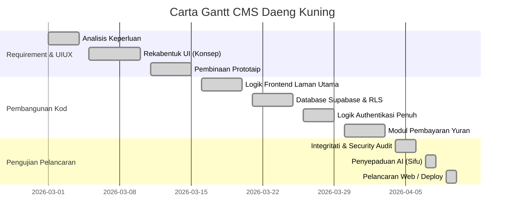

# Bab 2: Pengurusan Projek & Fasa Pembangunan

## 2.1 Ringkasan Pembangunan (Agile Methodology)
Skop projek ini dibangunkan melalui kaedah tangkas (*Agile*) berbanding cara tradisional *Waterfall*, di mana maklum balas perintis pengguna diterapkan dengan pantas secara *incremental*. Pembangunan telah dibahagikan kepada 6 fasa utama.

## 2.2 Fasa Langkah Demi Langkah (Step-by-step Development)

### Fasa 1: Pengumpulan Syarat Ciri Kerja (Requirements)
- Berunding secara terperinci dengan pihak pentadbir APDK untuk memahami apa spesifikasi yang mereka mahukan.
- Menentukan teknologi (HTML/Vanilla JS/Supabase/Vercel) yang sesuai bagi mencapai *zero maintenance cost* untuk fasa permulaan.

### Fasa 2: Reka Bentuk Visual (UI/UX)
- Perincian estetika moden: Latar belakang gelap (Dark Mode), emas premium, dan efek silau (*Glassmorphism*).
- Peringkat pembinaan prototaip elemen *dashboard*, grid bayaran, profil, borang, dan elemen navigasi mudah alih.

### Fasa 3: Pembangunan Aplikasi Depan (Frontend)
- Menulis kod struktur dan gaya di pelayar web menggunakan *TailwindCSS*.
- Mengawal perjalanan transisi modul dengan asinkroni fail *JavaScript* yang terasing agar persekitaran laman bergerak secara aplikasi satu halaman (*Single-Page Application* / SPA).

### Fasa 4: Integriti & Integasi Pangkalan Data (Backend)
- Mewujudkan projek `Supabase`. 
- Menyediakan polisi akses secara peringkat baris (RLS - *Row Level Security*).
- Mengintegrasikan fungsi Auth untuk memastikan pelajar log masuk secara ketat tanpa sesi pelayar yang lemah.

### Fasa 5: Pelaksanaan Ciri Canggih & Ujian Alpha
- Menambah sistem Auto-Generate ID Ahli (ID Janaan Autonomi).
- Melaksanakan pemformatan paparan data ke format bahasa tempatan (bulan-bulan dalam kalendar). 
- Penambahan integrasi robot AI (Sifu AI).
- Pengujian kerentanan penggodaman mudah untuk memastikan RBAC gagal berfungsi membolehkan 'Pelajar' akses laman 'Admin'. Semua lompang dibaiki segera.

### Fasa 6: Pelepasan Pengeluaran (Production Deployment)
- Konfigurasi penyatuan (*domain binding*) di Vercel.
- Pemantauan metrik masa tindak balas (Load testing).

## 2.3 Visual Carta Gantt Perjalanan Projek

