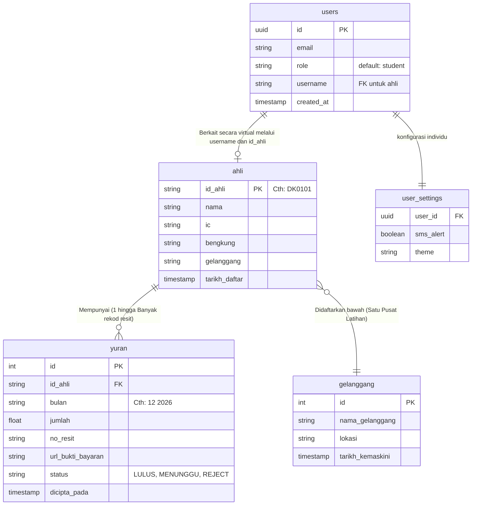

# Bab 4: Seni Bina Pangkalan Data & ERD

## 4.1 Pemilihan Enjin Pangkalan Data (Supabase)
Berkenaan tapak operasi data, CMS APDK dikuasakan sepenuhnya oleh **Supabase (PostgreSQL 15)**. 
Ianya sebuah *BaaS (Backend-as-a-Service)* sumber terbuka yang mampu berfungsi setarap penyelesaian pangkalan data peringkat atas (seperti *Firebase* atau *AWS RDS*), tetapi memiliki keunggulan hubungan rentas (*relational*) dan kawalan *row-level security* (Paling kebal).

## 4.2 Entiti Jadual Pangkalan Data (Atribut & Meta)

### Jadual Utama:
1. **users** (Akaun Login) - Menyimpan hak peranan log masuk (*Role-based sessions*). *Tidak bercampur dengan data peribadi bagi menangkis godaman suntikan maklumat palsu.*
2. **ahli** (Biodata) - Hab tumpuan utama menyimpan profil fizikal. Dipautkan secara unik pada `id_ahli`.
3. **yuran** (Lebuh Raya Kewangan) - Pemanjangan bil dari bendahari; Setiap *row* dikaitkan kepada profil dalam jadual `ahli` melalui *Foreign Key* dan disertakan status ('LULUS', 'PENDING').
4. **kehadiran** *[TBD]* - Menyimpan imbas kad/lokasi sesi mingguan.
5. **gelanggang** (Fasiliti Latihan) - Pangkalan rujukan metadata bagi alamat rasmi kelas latihan.

## 4.3 Rajah Perhubungan Entiti (ERD Entity Relationship)

Di bawah merupakan gambaran skematik rasmi di antara entiti Jadual Pangkalan Data mengikut piawaian ERD (Entity Relationship Diagram) di dalam Supabase:

## 4.4 Ciri Keselamatan Tahap Medan (Field Limits)
Sistem menggunakan *Type Validation* secara natural. Memandangkan `jumlah` diletakkan sebagai spesifikasi (Float/Number), walau setebal mana pun penggodam cuba menghantar kod tulisan berbahaya di ruangan borang nilai hutang, sistem pangkalan data menolaknya secara mutlak di muka pintu tanpa cuba memproses kod tersebut.
